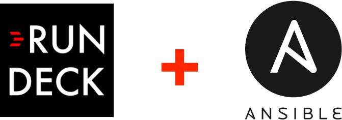

# Ansible + Rundeck side-project

## Description
Ansible + Rundeck + Docker all-in-one

## Architecture

## Completed
- Ansible and Rundeck integration
- Authentication via LDAP

## Next-step
- Integrate pull-based feature for automation
- Enrich ansible playbook

## License
Distributed under the MIT License. See [LICENSE](./LICENSE) for more information.
